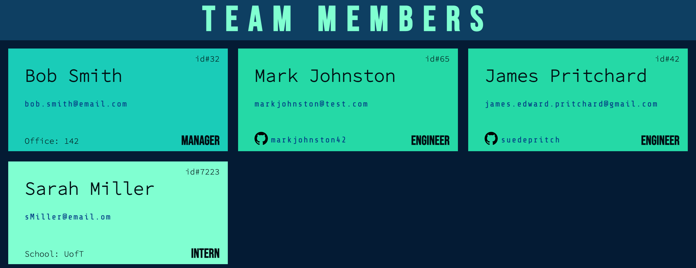

# Employee Contact Tracker

### Description
This app uses the inquirer package to allow CLI input of employee information and creates an html file to display information

[Walkthrough Video](https://drive.google.com/file/d/1vSswxkmOu8gT0ViyKIFvuuhvrtSUCoKA/view)

### Installation
install dependancies

    npm install 

run app

    node index  

### Testing
run unit tests

    npm test

### Contributions
[Issues and Pull requests can be made to this repo](https://github.com/SuedePritch/scaling-journey)

### Technology
* NodeJS
* Inquirer
* Jest 

  

  

  

